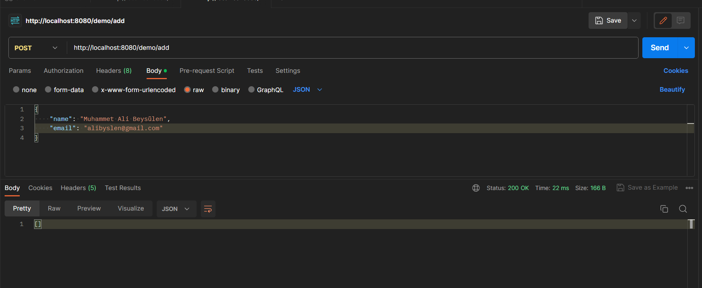
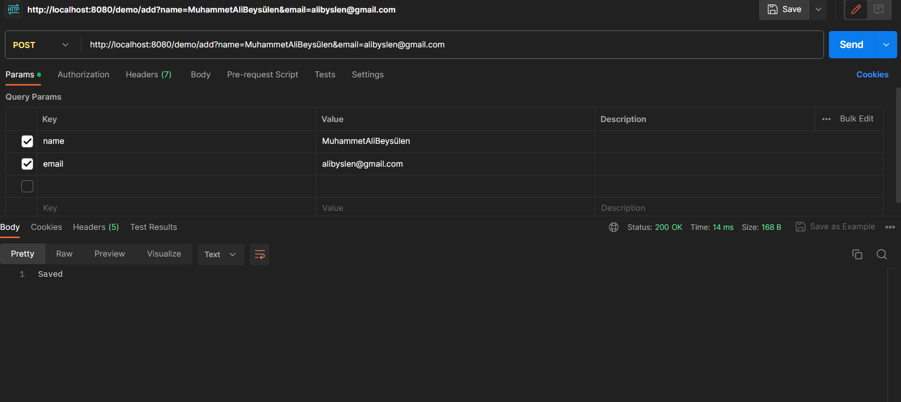
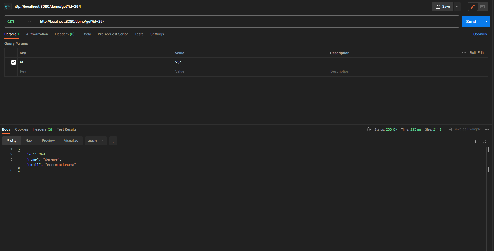
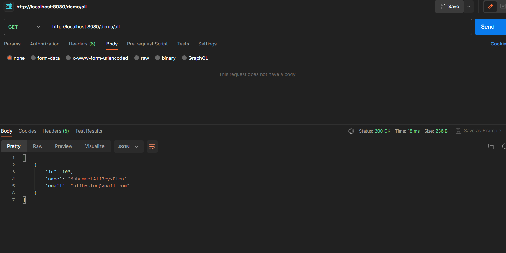
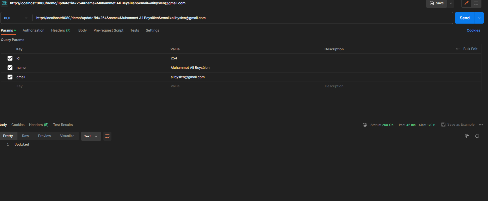
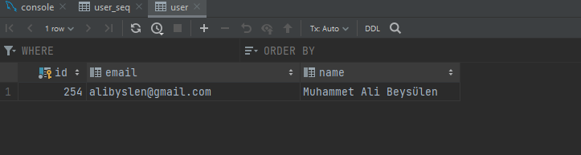
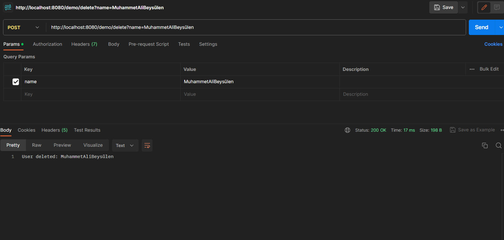

<h1>Usage</h1>

<ul>

<li>     To add a new user, send a <i>POST</i> request to <strong>http://localhost:8080/demo/add.</strong> Send name and email parameters in <i>JSON</i> format in the request body.    </li>

<li>  To view all users, send a <i>GET</i> request to<strong> http://localhost:8080/demo/all.  </strong>     </li>

<li>   To delete a user by name, send a <i>POST</i> request to<strong> http://localhost:8080/demo/delete.</strong> Send the name parameter in the request body.      </li>
  
</ul>

<h1>    Requirements    </h1>
<ul>

<li>   Java Development Kit (JDK) 11 or higher  </li>
<li>  Maven 3.x</li>
<li> - MySQL database (or configuration for another database connection)
 </li>
  
</ul>

<h1> Installation and Operation </h1>
<ol>

<li> Clone this project from GitHub or download it as a zip.  </li>
<li>  Go to the project directory: </li>


  
</ol>


<h2>Before running the application   </h2>

<strong> application.properties </strong> file and enter your database connection information:

```bash
spring.datasource.url=jdbc:mysql://localhost:3306/your_database_name
spring.datasource.username=your_username
spring.datasource.password=your_password


```
Add user

 



Get user 



Get All users




Update User





Delete user




